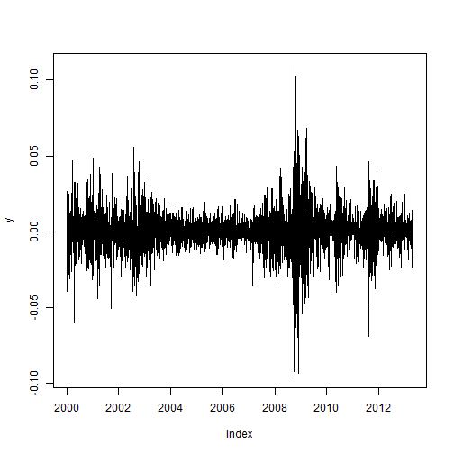
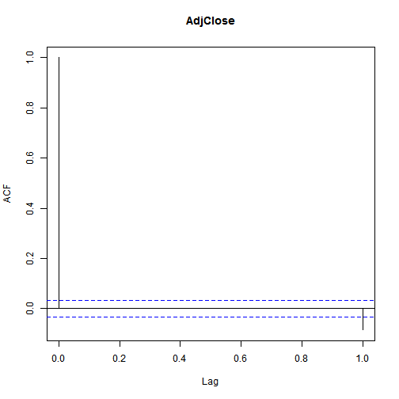
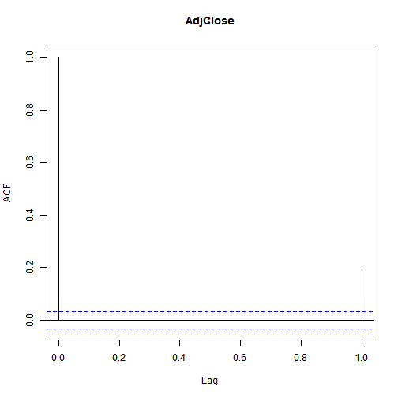
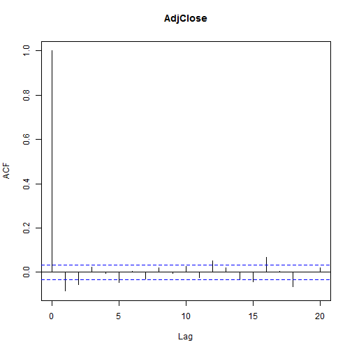
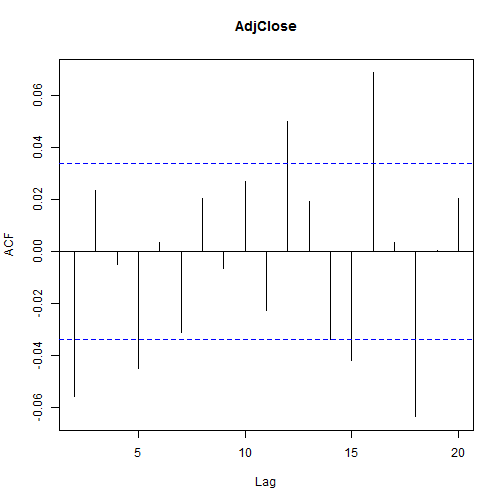
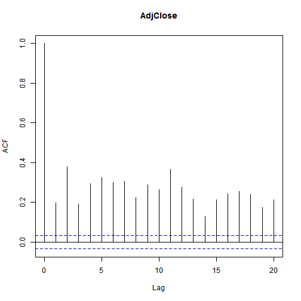
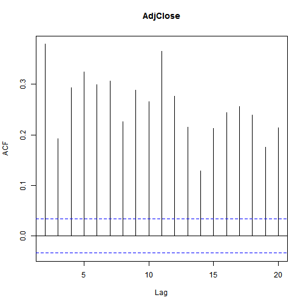
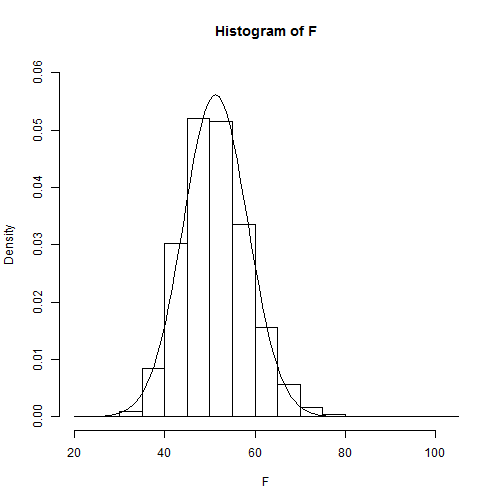
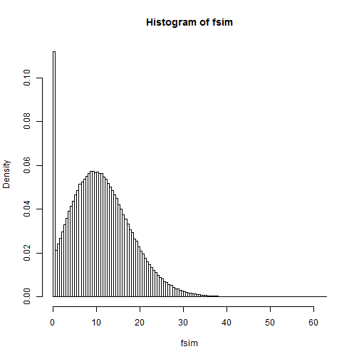

1 金融市场，价格和风险
========================================================
1.1 价格，回报率和股票指数
--------------------------------------
### 1.1.1 股票指数
#### 价格权重指数
价格权重指数是根据价格来定义各个股票的权重，价格高则权重高，但这个方法并不能真正反映基础市场的价值
#### 价值权重指数
价值权重指数是根据整个市场已发行股票的价值来定义权重的
### 1.1.2 价格和收益
\( p_t=\frac{p_t-p_{t-1}}{p_{t-1}}\)

1.2 S&P500 回报率
----------------------------------------

```r
library("tseries")  # load the tseries library
library("zoo")
```

```
## Attaching package: 'zoo'
```

```
## The following object is masked from 'package:base':
## 
## as.Date, as.Date.numeric
```

```r
price = get.hist.quote(instrument = "^gspc", start = "2000-01-01", quote = "AdjClose")  # download the prices,from January 1, 2000 until today
```

```
## time series starts 2000-01-03
```

```r
y = diff(log(price))  # convert the prices into returns
plot(y)  # plot the returns
```

 

```r
y = coredata(y)  # strip date information from returns
library("moments")
```

```
## Error: there is no package called 'moments'
```

```r
sd(y)
```

```
## [1] 0.0134
```

```r
min(y)
```

```
## [1] -0.0947
```

```r
max(y)
```

```
## [1] 0.1096
```

```r
skewness(y)
```

```
## Error: could not find function "skewness"
```

```r
kurtosis(y)
```

```
## Error: could not find function "kurtosis"
```

```r
acf(y, 1)
```

 

```r
acf(y^2, 1)
```

 

```r
jarque.bera.test(y)
```

```
## 
## 	Jarque Bera Test
## 
## data:  y
## X-squared = 7732, df = 2, p-value < 2.2e-16
```

```r
Box.test(y, lag = 20, type = c("Ljung-Box"))
```

```
## 
## 	Box-Ljung test
## 
## data:  y
## X-squared = 102.9, df = 20, p-value = 3.862e-13
```

```r
Box.test(y^2, lag = 20, type = c("Ljung-Box"))
```

```
## 
## 	Box-Ljung test
## 
## data:  y^2
## X-squared = 4626, df = 20, p-value < 2.2e-16
```

1.3 回报率的程式化因子
-------------------------
* 波动集群
* 后尾
* 非线性相关

1.4 波动率
-----------------------
收益率的标准偏差称为波动率

```r
library(MASS, stats)  # load stats and MASS package
q = acf(y, 20)
```

 

```r
plot(q[2:20])
```

 

```r
q = acf(y^2, 20)
```

 

```r
plot(q[2:20])
```

 

```r
b = Box.test(y, lag = 21, type = "Ljung-Box")
b
```

```
## 
## 	Box-Ljung test
## 
## data:  y
## X-squared = 110.9, df = 21, p-value = 3.231e-14
```


1.6 后尾的定义
----------
### 1.6.1 后尾的检验
相比于同方差同均值的正态分布而言，具有更多极端值的分布称之为后尾分布


2单变量的波动模型
==========================
本章主要讲述了单边量的波动模型，包括ARCH模型，GARCH模型，


Listing 2.1 Garch and estmation in R

```r
library(tseries)
library(zoo)
p = get.hist.quote(instrument = "^gspc", start = "2005-01-01", end = "2009-12-31", 
    quote = "AdjClose", quiet = T)  # download the prices
y = diff(log(p)) * 100  # get returns and multiply them by 100 (so they are expressed in returns)
y = y - mean(y)  # de-mean (set mean to zero)
library(fGarch)
```

```
## Loading required package: timeDate
```

```
## Loading required package: timeSeries
```

```
## Attaching package: 'timeSeries'
```

```
## The following object is masked from 'package:zoo':
## 
## time<-
```

```
## Loading required package: fBasics
```

```
## Attaching package: 'fBasics'
```

```
## The following object is masked from 'package:base':
## 
## norm
```

```r
garchFit(~garch(1, 0), data = y, include.mean = FALSE)
```

```
## 
## Series Initialization:
##  ARMA Model:                arma
##  Formula Mean:              ~ arma(0, 0)
##  GARCH Model:               garch
##  Formula Variance:          ~ garch(1, 0)
##  ARMA Order:                0 0
##  Max ARMA Order:            0
##  GARCH Order:               1 0
##  Max GARCH Order:           1
##  Maximum Order:             1
##  Conditional Dist:          norm
##  h.start:                   2
##  llh.start:                 1
##  Length of Series:          1258
##  Recursion Init:            mci
##  Series Scale:              1.517
## 
## Parameter Initialization:
##  Initial Parameters:          $params
##  Limits of Transformations:   $U, $V
##  Which Parameters are Fixed?  $includes
##  Parameter Matrix:
##                     U         V params includes
##     mu     -2.045e-16 2.045e-16    0.0    FALSE
##     omega   1.000e-06 1.000e+02    0.1     TRUE
##     alpha1  1.000e-08 1.000e+00    0.1     TRUE
##     gamma1 -1.000e+00 1.000e+00    0.1    FALSE
##     delta   0.000e+00 2.000e+00    2.0    FALSE
##     skew    1.000e-01 1.000e+01    1.0    FALSE
##     shape   1.000e+00 1.000e+01    4.0    FALSE
##  Index List of Parameters to be Optimized:
##  omega alpha1 
##      2      3 
##  Persistence:                  0.1 
## 
## 
## --- START OF TRACE ---
## Selected Algorithm: nlminb 
## 
## R coded nlminb Solver: 
## 
##   0:     3619.7535: 0.100000 0.100000
##   1:     1736.5493:  1.05877 0.384182
##   2:     1734.9231: 0.910957 0.861833
##   3:     1727.5654: 0.863579 0.885867
##   4:     1706.4504: 0.384832  1.00000
##   5:     1701.9170: 0.664453  1.00000
##   6:     1686.8002: 0.680349 0.500253
##   7:     1684.6694: 0.630763 0.457624
##   8:     1683.9466: 0.591071 0.552831
##   9:     1683.9427: 0.593749 0.554564
##  10:     1683.9425: 0.593205 0.554806
##  11:     1683.9425: 0.593178 0.554881
##  12:     1683.9425: 0.593177 0.554892
## 
## Final Estimate of the Negative LLH:
##  LLH:  2208    norm LLH:  1.755 
##  omega alpha1 
## 1.3655 0.5549 
## 
## R-optimhess Difference Approximated Hessian Matrix:
##         omega alpha1
## omega  -215.2 -114.4
## alpha1 -114.4 -176.8
## attr(,"time")
## Time difference of 0.014 secs
## 
## --- END OF TRACE ---
## 
## 
## Time to Estimate Parameters:
##  Time difference of 0.145 secs
```

```
## 
## Title:
##  GARCH Modelling 
## 
## Call:
##  garchFit(formula = ~garch(1, 0), data = y, include.mean = FALSE) 
## 
## Mean and Variance Equation:
##  data ~ garch(1, 0)
## <environment: 0x0775b648>
##  [data = y]
## 
## Conditional Distribution:
##  norm 
## 
## Coefficient(s):
##   omega   alpha1  
## 1.36554  0.55489  
## 
## Std. Errors:
##  based on Hessian 
## 
## Error Analysis:
##         Estimate  Std. Error  t value Pr(>|t|)    
## omega    1.36554     0.08417   16.224  < 2e-16 ***
## alpha1   0.55489     0.09287    5.975  2.3e-09 ***
## ---
## Signif. codes:  0 '***' 0.001 '**' 0.01 '*' 0.05 '.' 0.1 ' ' 1
## 
## Log Likelihood:
##  -2208    normalized:  -1.755 
## 
## Description:
##  Fri Apr 26 11:40:19 2013 by user: Z-Q
```

```r
garchFit(~garch(4, 0), data = y, include.mean = FALSE)
```

```
## 
## Series Initialization:
##  ARMA Model:                arma
##  Formula Mean:              ~ arma(0, 0)
##  GARCH Model:               garch
##  Formula Variance:          ~ garch(4, 0)
##  ARMA Order:                0 0
##  Max ARMA Order:            0
##  GARCH Order:               4 0
##  Max GARCH Order:           4
##  Maximum Order:             4
##  Conditional Dist:          norm
##  h.start:                   5
##  llh.start:                 1
##  Length of Series:          1258
##  Recursion Init:            mci
##  Series Scale:              1.517
## 
## Parameter Initialization:
##  Initial Parameters:          $params
##  Limits of Transformations:   $U, $V
##  Which Parameters are Fixed?  $includes
##  Parameter Matrix:
##                     U         V params includes
##     mu     -2.045e-16 2.045e-16  0.000    FALSE
##     omega   1.000e-06 1.000e+02  0.100     TRUE
##     alpha1  1.000e-08 1.000e+00  0.025     TRUE
##     alpha2  1.000e-08 1.000e+00  0.025     TRUE
##     alpha3  1.000e-08 1.000e+00  0.025     TRUE
##     alpha4  1.000e-08 1.000e+00  0.025     TRUE
##     gamma1 -1.000e+00 1.000e+00  0.100    FALSE
##     gamma2 -1.000e+00 1.000e+00  0.100    FALSE
##     gamma3 -1.000e+00 1.000e+00  0.100    FALSE
##     gamma4 -1.000e+00 1.000e+00  0.100    FALSE
##     delta   0.000e+00 2.000e+00  2.000    FALSE
##     skew    1.000e-01 1.000e+01  1.000    FALSE
##     shape   1.000e+00 1.000e+01  4.000    FALSE
##  Index List of Parameters to be Optimized:
##  omega alpha1 alpha2 alpha3 alpha4 
##      2      3      4      5      6 
##  Persistence:                  0.1 
## 
## 
## --- START OF TRACE ---
## Selected Algorithm: nlminb 
## 
## R coded nlminb Solver: 
## 
##   0:     2409.5886: 0.100000 0.0250000 0.0250000 0.0250000 0.0250000
##   1:     1634.2681: 0.605504 0.341611 0.493258 0.452004 0.517571
##   2:     1508.9667: 0.177761 0.317173 0.644313 0.562588 0.694749
##   3:     1484.7888: 0.125350 0.297703 0.630150 0.548161 0.680585
##   4:     1483.0467: 0.0293856 0.249943 0.596677 0.514236 0.646238
##   5:     1460.6657: 0.0901598 0.245816 0.594548 0.511509 0.642660
##   6:     1419.9971: 0.0881340 0.237176 0.212690 0.270380 0.536730
##   7:     1412.6610: 0.141853 0.224502 0.219612 0.272670 0.529546
##   8:     1406.2625: 0.116981 0.175002 0.215501 0.270963 0.521647
##   9:     1399.1552: 0.164221 0.0770032 0.221573 0.293958 0.507377
##  10:     1397.1205: 0.111162 0.0815859 0.199592 0.397825 0.316824
##  11:     1391.5523: 0.151695 0.0487936 0.257950 0.367466 0.360498
##  12:     1390.8295: 0.121618 0.0484306 0.307081 0.295438 0.381622
##  13:     1390.4117: 0.142307 0.100555 0.325059 0.280405 0.309105
##  14:     1390.1985: 0.159271 0.0312684 0.276898 0.306367 0.338616
##  15:     1390.1285: 0.121470 0.0573769 0.274604 0.299863 0.329666
##  16:     1388.6310: 0.144747 0.0599697 0.277652 0.301165 0.329622
##  17:     1388.4076: 0.142632 0.0522377 0.277043 0.304677 0.307654
##  18:     1388.2748: 0.143882 0.0564945 0.288840 0.284835 0.310300
##  19:     1388.2715: 0.141054 0.0600232 0.288784 0.285109 0.300287
##  20:     1388.2571: 0.146141 0.0599910 0.290309 0.286269 0.299476
##  21:     1388.2365: 0.143608 0.0588209 0.293842 0.287907 0.296783
##  22:     1388.2352: 0.143808 0.0579819 0.293315 0.287230 0.296642
##  23:     1388.2344: 0.144044 0.0584477 0.292403 0.286684 0.296954
##  24:     1388.2344: 0.143977 0.0583760 0.292362 0.286571 0.296953
##  25:     1388.2344: 0.144066 0.0583770 0.292352 0.286486 0.297046
##  26:     1388.2343: 0.144027 0.0583796 0.292265 0.286326 0.297294
##  27:     1388.2343: 0.144115 0.0583935 0.292171 0.286096 0.297131
##  28:     1388.2343: 0.144081 0.0584085 0.292230 0.285995 0.297129
##  29:     1388.2343: 0.144095 0.0584235 0.292184 0.286010 0.297173
##  30:     1388.2343: 0.144096 0.0584091 0.292194 0.286010 0.297172
##  31:     1388.2343: 0.144095 0.0584118 0.292200 0.286014 0.297162
## 
## Final Estimate of the Negative LLH:
##  LLH:  1913    norm LLH:  1.52 
##   omega  alpha1  alpha2  alpha3  alpha4 
## 0.33172 0.05841 0.29220 0.28601 0.29716 
## 
## R-optimhess Difference Approximated Hessian Matrix:
##          omega  alpha1 alpha2 alpha3 alpha4
## omega  -1256.4  -440.4 -324.6 -348.6 -287.6
## alpha1  -440.4 -2405.5 -257.9 -360.9 -324.8
## alpha2  -324.6  -257.9 -591.2 -156.3 -222.9
## alpha3  -348.6  -360.9 -156.3 -652.8 -156.2
## alpha4  -287.6  -324.8 -222.9 -156.2 -592.5
## attr(,"time")
## Time difference of 0.137 secs
## 
## --- END OF TRACE ---
## 
## 
## Time to Estimate Parameters:
##  Time difference of 0.504 secs
```

```
## 
## Title:
##  GARCH Modelling 
## 
## Call:
##  garchFit(formula = ~garch(4, 0), data = y, include.mean = FALSE) 
## 
## Mean and Variance Equation:
##  data ~ garch(4, 0)
## <environment: 0x04c33c04>
##  [data = y]
## 
## Conditional Distribution:
##  norm 
## 
## Coefficient(s):
##    omega    alpha1    alpha2    alpha3    alpha4  
## 0.331720  0.058412  0.292200  0.286014  0.297162  
## 
## Std. Errors:
##  based on Hessian 
## 
## Error Analysis:
##         Estimate  Std. Error  t value Pr(>|t|)    
## omega    0.33172     0.03285   10.097  < 2e-16 ***
## alpha1   0.05841     0.02198    2.657  0.00789 ** 
## alpha2   0.29220     0.04664    6.266 3.71e-10 ***
## alpha3   0.28601     0.04376    6.536 6.30e-11 ***
## alpha4   0.29716     0.04636    6.410 1.46e-10 ***
## ---
## Signif. codes:  0 '***' 0.001 '**' 0.01 '*' 0.05 '.' 0.1 ' ' 1
## 
## Log Likelihood:
##  -1913    normalized:  -1.52 
## 
## Description:
##  Fri Apr 26 11:40:20 2013 by user: Z-Q
```

```r
garchFit(~garch(4, 1), data = y, include.mean = FALSE)
```

```
## 
## Series Initialization:
##  ARMA Model:                arma
##  Formula Mean:              ~ arma(0, 0)
##  GARCH Model:               garch
##  Formula Variance:          ~ garch(4, 1)
##  ARMA Order:                0 0
##  Max ARMA Order:            0
##  GARCH Order:               4 1
##  Max GARCH Order:           4
##  Maximum Order:             4
##  Conditional Dist:          norm
##  h.start:                   5
##  llh.start:                 1
##  Length of Series:          1258
##  Recursion Init:            mci
##  Series Scale:              1.517
## 
## Parameter Initialization:
##  Initial Parameters:          $params
##  Limits of Transformations:   $U, $V
##  Which Parameters are Fixed?  $includes
##  Parameter Matrix:
##                     U         V params includes
##     mu     -2.045e-16 2.045e-16  0.000    FALSE
##     omega   1.000e-06 1.000e+02  0.100     TRUE
##     alpha1  1.000e-08 1.000e+00  0.025     TRUE
##     alpha2  1.000e-08 1.000e+00  0.025     TRUE
##     alpha3  1.000e-08 1.000e+00  0.025     TRUE
##     alpha4  1.000e-08 1.000e+00  0.025     TRUE
##     gamma1 -1.000e+00 1.000e+00  0.100    FALSE
##     gamma2 -1.000e+00 1.000e+00  0.100    FALSE
##     gamma3 -1.000e+00 1.000e+00  0.100    FALSE
##     gamma4 -1.000e+00 1.000e+00  0.100    FALSE
##     beta1   1.000e-08 1.000e+00  0.800     TRUE
##     delta   0.000e+00 2.000e+00  2.000    FALSE
##     skew    1.000e-01 1.000e+01  1.000    FALSE
##     shape   1.000e+00 1.000e+01  4.000    FALSE
##  Index List of Parameters to be Optimized:
##  omega alpha1 alpha2 alpha3 alpha4  beta1 
##      2      3      4      5      6     11 
##  Persistence:                  0.9 
## 
## 
## --- START OF TRACE ---
## Selected Algorithm: nlminb 
## 
## R coded nlminb Solver: 
## 
##   0:     1454.0447: 0.100000 0.0250000 0.0250000 0.0250000 0.0250000 0.800000
##   1:     1421.1372: 0.0859711 0.0243535 0.0248923 0.0249677 0.0252496 0.792899
##   2:     1363.8284: 0.0568752 0.0254567 0.0274169 0.0277607 0.0287641 0.782100
##   3:     1361.7406: 1.00000e-06 0.0535091 0.0686093 0.0724666 0.0790831 0.744097
##   4:     1326.5003: 0.0262444 0.0545103 0.0698955 0.0739075 0.0808466 0.746825
##   5:     1306.3077: 0.0171893 1.00000e-08 0.0295200 0.0475685 0.0596863 0.814206
##   6:     1303.6136: 0.0155295 1.00000e-08 0.0334227 0.0646853 0.0870203 0.802417
##   7:     1302.8752: 0.0124800 1.00000e-08 0.0325557 0.0638882 0.0862444 0.801591
##   8:     1302.5268: 0.0137285 1.00000e-08 0.0304067 0.0631009 0.0859054 0.803840
##   9:     1302.2210: 0.0131067 1.00000e-08 0.0257736 0.0610495 0.0844557 0.808281
##  10:     1302.1166: 0.0142083 1.00000e-08 0.0246580 0.0605445 0.0801468 0.813439
##  11:     1301.9123: 0.0130200 1.00000e-08 0.0233028 0.0607878 0.0750261 0.817723
##  12:     1301.8691: 0.0132720 1.00000e-08 0.0197157 0.0596741 0.0808318 0.817645
##  13:     1301.8157: 0.0127305 1.00000e-08 0.0285859 0.0524468 0.0746367 0.822330
##  14:     1301.7625: 0.0107783 1.00000e-08 0.0259073 0.0627508 0.0684135 0.828300
##  15:     1301.7211: 0.0113005 1.00000e-08 0.0258069 0.0626756 0.0683645 0.828357
##  16:     1301.6968: 0.0111292 1.00000e-08 0.0254756 0.0623912 0.0681249 0.828228
##  17:     1301.6697: 0.0115587 1.00000e-08 0.0249348 0.0618267 0.0687064 0.828434
##  18:     1301.6345: 0.0112946 1.00000e-08 0.0239627 0.0605500 0.0701205 0.828677
##  19:     1301.5690: 0.0115151 1.00000e-08 0.0207939 0.0594502 0.0719591 0.830710
##  20:     1301.5548: 0.0111579 1.00000e-08 0.0200001 0.0619979 0.0687002 0.831683
##  21:     1301.5405: 0.0112880 1.00000e-08 0.0192838 0.0642931 0.0655428 0.833429
##  22:     1301.5093: 0.0109835 1.00000e-08 0.0195059 0.0576699 0.0715898 0.834873
##  23:     1301.5062: 0.0108777 1.00000e-08 0.0194466 0.0576190 0.0715383 0.834848
##  24:     1301.5046: 0.0109821 1.00000e-08 0.0193820 0.0575710 0.0714900 0.834878
##  25:     1301.5016: 0.0108989 1.00000e-08 0.0192794 0.0575799 0.0713067 0.835054
##  26:     1301.4753: 0.0105717 1.00000e-08 0.0183692 0.0585168 0.0681855 0.838863
##  27:     1301.4751: 0.0106026 1.00000e-08 0.0138868 0.0587259 0.0700663 0.840407
##  28:     1301.4640: 0.0102893 1.00000e-08 0.0169715 0.0569871 0.0665746 0.842948
##  29:     1301.4630: 0.0103454 1.00000e-08 0.0176236 0.0572678 0.0667403 0.842040
##  30:     1301.4629: 0.0103324 1.00000e-08 0.0174860 0.0572276 0.0667049 0.842216
##  31:     1301.4629: 0.0103331 1.00000e-08 0.0174900 0.0572204 0.0667014 0.842220
## 
## Final Estimate of the Negative LLH:
##  LLH:  1826    norm LLH:  1.451 
##     omega    alpha1    alpha2    alpha3    alpha4     beta1 
## 2.379e-02 1.000e-08 1.749e-02 5.722e-02 6.670e-02 8.422e-01 
## 
## R-optimhess Difference Approximated Hessian Matrix:
##         omega alpha1 alpha2 alpha3 alpha4  beta1
## omega  -79440 -25971 -25061 -25037 -25579 -39015
## alpha1 -25971 -24164 -21673 -20632 -20287 -23003
## alpha2 -25061 -21673 -22052 -20738 -20482 -23098
## alpha3 -25037 -20632 -20738 -20672 -20079 -22858
## alpha4 -25579 -20287 -20482 -20079 -20621 -23197
## beta1  -39015 -23003 -23098 -22858 -23197 -29762
## attr(,"time")
## Time difference of 0.195 secs
## 
## --- END OF TRACE ---
## 
## 
## Time to Estimate Parameters:
##  Time difference of 0.573 secs
```

```
## 
## Title:
##  GARCH Modelling 
## 
## Call:
##  garchFit(formula = ~garch(4, 1), data = y, include.mean = FALSE) 
## 
## Mean and Variance Equation:
##  data ~ garch(4, 1)
## <environment: 0x0779ff6c>
##  [data = y]
## 
## Conditional Distribution:
##  norm 
## 
## Coefficient(s):
##      omega      alpha1      alpha2      alpha3      alpha4       beta1  
## 0.02378770  0.00000001  0.01748996  0.05722037  0.06670140  0.84222003  
## 
## Std. Errors:
##  based on Hessian 
## 
## Error Analysis:
##         Estimate  Std. Error  t value Pr(>|t|)    
## omega  2.379e-02   7.351e-03    3.236  0.00121 ** 
## alpha1 1.000e-08   1.899e-02    0.000  1.00000    
## alpha2 1.749e-02   3.321e-02    0.527  0.59840    
## alpha3 5.722e-02   3.738e-02    1.531  0.12585    
## alpha4 6.670e-02   3.626e-02    1.839  0.06586 .  
## beta1  8.422e-01   2.666e-02   31.589  < 2e-16 ***
## ---
## Signif. codes:  0 '***' 0.001 '**' 0.01 '*' 0.05 '.' 0.1 ' ' 1
## 
## Log Likelihood:
##  -1826    normalized:  -1.451 
## 
## Description:
##  Fri Apr 26 11:40:20 2013 by user: Z-Q
```

```r
garchFit(~garch(1, 1), data = y, include.mean = FALSE)
```

```
## 
## Series Initialization:
##  ARMA Model:                arma
##  Formula Mean:              ~ arma(0, 0)
##  GARCH Model:               garch
##  Formula Variance:          ~ garch(1, 1)
##  ARMA Order:                0 0
##  Max ARMA Order:            0
##  GARCH Order:               1 1
##  Max GARCH Order:           1
##  Maximum Order:             1
##  Conditional Dist:          norm
##  h.start:                   2
##  llh.start:                 1
##  Length of Series:          1258
##  Recursion Init:            mci
##  Series Scale:              1.517
## 
## Parameter Initialization:
##  Initial Parameters:          $params
##  Limits of Transformations:   $U, $V
##  Which Parameters are Fixed?  $includes
##  Parameter Matrix:
##                     U         V params includes
##     mu     -2.045e-16 2.045e-16    0.0    FALSE
##     omega   1.000e-06 1.000e+02    0.1     TRUE
##     alpha1  1.000e-08 1.000e+00    0.1     TRUE
##     gamma1 -1.000e+00 1.000e+00    0.1    FALSE
##     beta1   1.000e-08 1.000e+00    0.8     TRUE
##     delta   0.000e+00 2.000e+00    2.0    FALSE
##     skew    1.000e-01 1.000e+01    1.0    FALSE
##     shape   1.000e+00 1.000e+01    4.0    FALSE
##  Index List of Parameters to be Optimized:
##  omega alpha1  beta1 
##      2      3      5 
##  Persistence:                  0.9 
## 
## 
## --- START OF TRACE ---
## Selected Algorithm: nlminb 
## 
## R coded nlminb Solver: 
## 
##   0:     1464.0419: 0.100000 0.100000 0.800000
##   1:     1408.6500: 0.0719156 0.100213 0.787311
##   2:     1371.3860: 0.0423929 0.108386 0.783937
##   3:     1326.9183: 0.0170660 0.159354 0.818348
##   4:     1326.5107: 0.0156579 0.159291 0.819245
##   5:     1325.5213: 0.0158487 0.159859 0.825903
##   6:     1323.3669: 0.0107953 0.152760 0.836042
##   7:     1320.9185: 0.0114416 0.145853 0.847471
##   8:     1317.8373: 0.00627024 0.128548 0.871830
##   9:     1315.7510: 0.00819318 0.105307 0.891214
##  10:     1313.4134: 0.00598171 0.0915625 0.896114
##  11:     1312.9120: 0.00688092 0.0806210 0.905978
##  12:     1312.4148: 0.00518630 0.0796297 0.911382
##  13:     1312.4071: 0.00528744 0.0796547 0.911406
##  14:     1312.4063: 0.00524914 0.0797544 0.911413
##  15:     1312.4050: 0.00529620 0.0799133 0.911278
##  16:     1312.4035: 0.00528258 0.0800567 0.911120
##  17:     1312.4009: 0.00533692 0.0804867 0.910677
##  18:     1312.3997: 0.00531799 0.0810074 0.910341
##  19:     1312.3995: 0.00537938 0.0813059 0.909801
##  20:     1312.3991: 0.00536138 0.0811762 0.910024
##  21:     1312.3991: 0.00536052 0.0811727 0.910029
##  22:     1312.3991: 0.00536061 0.0811730 0.910028
## 
## Final Estimate of the Negative LLH:
##  LLH:  1837    norm LLH:  1.46 
##   omega  alpha1   beta1 
## 0.01234 0.08117 0.91003 
## 
## R-optimhess Difference Approximated Hessian Matrix:
##          omega alpha1   beta1
## omega  -242329 -79509 -117673
## alpha1  -79509 -64620  -72787
## beta1  -117673 -72787  -94188
## attr(,"time")
## Time difference of 0.033 secs
## 
## --- END OF TRACE ---
## 
## 
## Time to Estimate Parameters:
##  Time difference of 0.151 secs
```

```
## 
## Title:
##  GARCH Modelling 
## 
## Call:
##  garchFit(formula = ~garch(1, 1), data = y, include.mean = FALSE) 
## 
## Mean and Variance Equation:
##  data ~ garch(1, 1)
## <environment: 0x0779aae8>
##  [data = y]
## 
## Conditional Distribution:
##  norm 
## 
## Coefficient(s):
##    omega    alpha1     beta1  
## 0.012341  0.081173  0.910028  
## 
## Std. Errors:
##  based on Hessian 
## 
## Error Analysis:
##         Estimate  Std. Error  t value Pr(>|t|)    
## omega   0.012341    0.003542    3.484 0.000494 ***
## alpha1  0.081173    0.011952    6.791 1.11e-11 ***
## beta1   0.910028    0.012190   74.656  < 2e-16 ***
## ---
## Signif. codes:  0 '***' 0.001 '**' 0.01 '*' 0.05 '.' 0.1 ' ' 1
## 
## Log Likelihood:
##  -1837    normalized:  -1.46 
## 
## Description:
##  Fri Apr 26 11:40:20 2013 by user: Z-Q
```

```r
garchFit(~garch(1, 1), data = y, include.mean = FALSE, cond.dist = "std", trace = F)
```

```
## 
## Title:
##  GARCH Modelling 
## 
## Call:
##  garchFit(formula = ~garch(1, 1), data = y, cond.dist = "std", 
##     include.mean = FALSE, trace = F) 
## 
## Mean and Variance Equation:
##  data ~ garch(1, 1)
## <environment: 0x070a75b0>
##  [data = y]
## 
## Conditional Distribution:
##  std 
## 
## Coefficient(s):
##     omega     alpha1      beta1      shape  
## 0.0071921  0.0841405  0.9147936  6.8134599  
## 
## Std. Errors:
##  based on Hessian 
## 
## Error Analysis:
##         Estimate  Std. Error  t value Pr(>|t|)    
## omega   0.007192    0.003714    1.936   0.0528 .  
## alpha1  0.084140    0.014820    5.677 1.37e-08 ***
## beta1   0.914794    0.013652   67.006  < 2e-16 ***
## shape   6.813460    1.376231    4.951 7.39e-07 ***
## ---
## Signif. codes:  0 '***' 0.001 '**' 0.01 '*' 0.05 '.' 0.1 ' ' 1
## 
## Log Likelihood:
##  -1813    normalized:  -1.441 
## 
## Description:
##  Fri Apr 26 11:40:21 2013 by user: Z-Q
```

```r
res = garchFit(~garch(1, 1), data = y, include.mean = FALSE, cond.dist = "sstd", 
    trace = F)  # saves output to res
plot(res)  # shows various graphical analysis
```

```
## Error: menu() cannot be used non-interactively
```


5风险预测实施
===================
包含VaR和ES两个风险变预测手段，又分为非参数与参数估计的两种方法
5.1应用
---------
HS--历史模拟
第$p*T$个顺序观测值就是我们所需要的预测风险值，$p*T$需要时整数，则实际操作的时候需要将样本量进行删除。
5.2历史模拟
----------
### 5.2.1预期缺口估计（ES）
比-VaR值小的值的平均值
### 5.2.2$W_E$(window size)
大$W_E$的优缺点：
* 优点：VaR对个别极端值不敏感
* 缺点：旧数据对当前市场不具代表性

```r
library("tseries")  # time series library
# the two prices are downloaded separately
library(zoo)
p1 = get.hist.quote(instrument = "msft", start = "2000-01-01", end = "2009-12-31", 
    quote = "AdjClose")
```

```
## time series starts 2000-01-03
```

```r
p2 = get.hist.quote(instrument = "ibm", start = "2000-01-01", end = "2009-12-31", 
    quote = "AdjClose")
```

```
## time series starts 2000-01-03
```

```r
y1 = coredata(diff(log(p1)))  # convert prices to returns
y2 = coredata(diff(log(p2)))
y1 = tail(y1, T - 14)  # length adjustment
y2 = tail(y2, T - 14)
T = length(y1)
value = 1000  # portfolio value
y = cbind(y1, y2)  # combine returns in one matrix
p = 0.01  # probability
ys = sort(y1)  # sort returns
op = T * p  # p % smallest
VaR1 = -ys[op] * value  # VaR number
```


```r
w = matrix(c(0.3, 0.7))  # vector of portfolio weights
yp = y %*% w  # obtain portfolio returns
yps = sort(yp)
VaR2 = -yps[op] * value  # VaR number
```

收益率是正态分布时候的VaR
单变量

```r
sigma = sd(y1)  # estimate the volatility
VaR3 = -sigma * qnorm(p) * value  # calculate the VaR
```

多变量

```r
sigma1 = sqrt(t(w) %*% cov(y) %*% w)  # portfolio volatility
VaR4 = -sigma1 * qnorm(p) * value
```

收益率是t分布时候的VaR

```r
library(QRM)
```

```
## Loading required package: gsl
```

```
## Loading required package: Matrix
```

```
## Loading required package: lattice
```

```
## Loading required package: mvtnorm
```

```
## Loading required package: numDeriv
```

```
## Attaching package: 'QRM'
```

```
## The following object is masked from 'package:base':
## 
## lbeta
```

```r
scy1 = (y1) * 100  # scale the returns
res = fit.st(scy1)  # estimate the distribution parameters
sigma = res$par.ests[3]/100  # rescale the volatility
nu = res$par.ests[1]  # extract the degrees of freedom
VaR5 = -sigma * qt(df = nu, p = p) * value  # calculates the VaR
```


5.3.4 正态分布下的ES

```r
ES2 = sigma * dnorm(qnorm(p))/p * value
```


```r
VaR = -qnorm(p)
integrand = function(q) {
    q * dnorm(q)
}
ES = -sigma * integrate(integrand, -Inf, -VaR)$value/p * value
```

6期权和债券的VaR的分析
=========================
在第五章里讲的VaR分析是针对资产的VaR分析，这是只要知道资产的分布是什么就可以了，但是这个资产是不包括期权和债券的，因为他们本质的价值随时间的变化而改变。
6.1债券
----------
债券的价格计算公式如下：
$$P=g\left(r,t \right)=\sum_{1}^{T}\frac{\tau _t}{{(1+r)}^{t}}$$
r与P不是呈线性变化的
### 6.1.1
债券价格的变化随时间的变化可以表示如下式
$$g(r+dr)=g(r)+dr*g'(r)$$
修正的duration这么定义：${D}^{*}=-\frac{1}{P}g'(r)$
计算债券的VaR的第一步就是辨别利率变化的分布函数$r_t-r_{t-1}=dr\sim N(0,{\sigma _r}^{2})$


```r
source("bs.r")  # input the Black Scholes pricing function
```

```
## Warning: cannot open file 'bs.r': No such file or directory
```

```
## Error: cannot open the connection
```

```r
P0 = 50  # initial spot price
sigma = 0.2  # annual volatility
r = 0.05  # annual interest
T = 0.5  # time to expiration
X = 40  # strike price
f = bs(X, P0, r, sigma, T)  # analytical call price
```

```
## Error: could not find function "bs"
```

```r

S = 1e+06  # number of simulations
set.seed(12)  # set seed
F = P0 * exp(r * T)  # futures price
ysim = rnorm(S, -0.5 * sigma * sigma * T, sigma * sqrt(T))  # simulated returns with the log normal correction
F = F * exp(ysim)  # futures price
SP = F - X  # payoff
SP[SP < 0] = 0  # set negative outcomes to zero
fsim = SP * exp(-r * T)  # discount

hist(F, probability = TRUE, ylim = c(0, 0.06))  # make Figure 7.5
# make Figure 7.6
x = seq(min(F), max(F), length = 100)
lines(x, dnorm(x, mean = mean(F), sd = sd(SP)))
```

 

```r
hist(fsim, nclass = 100, probability = TRUE)
```

 

*** 7.3.1
VaR值的MC模拟步骤
1. 计算投资组合的初始价值
$$\vartheta _{t}=x^{b}P_{t}$$
2. 从正太分布中模拟S个一天收益率$y_{t+1,i}$
$$N\left ( 0,\sigma ^{2} \right ),i=1,2...S$$
3. 计算一天后的远期价格
$$P_{t+1,i}=P_te^{r(1/365)}e^{y_{t+1,i}}e^{-0.5\sigma ^2}$$
4. 计算投资组合模拟的远期价值
$$q_{t+1,i}=x^{b}P_{t+1,i}$$
5. 模拟出来的第i个的利/亏值
$$q_{t+1,i}=\vartheta _{t+1,i}-\vartheta _{t}$$
6. VaR可以直接从模拟出来的P/L数组里得到

```r
set.seed(1)  # set seed
S = 1e+07  # number of simulations
s2 = 0.01^2  # daily variance
p = 0.01  # probability
r = 0.05  # annual risk free
P = 100  # today’s price
ysim = rnorm(S, r/365 - 0.5 * s2, sqrt(s2))  # sim returns
Psim = P * exp(ysim)  # future prices
q = sort(Psim - P)  # simulated P/L
VaR1 = -q[p * S]  # get VaR
```

*** 7.3.2
债券的模拟步骤只要将第一与第四步替换成如下
1'. $$\vartheta _{t}=x^{0}g(P_{t},X,T,\sqrt{250}\sigma ,r)$$
4'. $$\vartheta _{t+1,i}=x^{0}g(P_{t+1,i},X,T-1/365,\sqrt{250}\sigma ,r)$$

```r
T = 0.25; # time to expiration
X = 100; # strike price
sigma = sqrt(s2 * 250); # annual volatility
source('bs.r')
```

```
## Warning: cannot open file 'bs.r': No such file or directory
```

```
## Error: cannot open the connection
```

```r
f=bs(X,P,r,sigma,T) # analytical call price
```

```
## Error: could not find function "bs"
```

```r
fsim = bs(X,Psim,r,sigma,T- (1/365)) # simulate option prices
```

```
## Error: could not find function "bs"
```

```r
q=sort(fsim$Call - f$Call) # simulated P/L
```

```
## Error: error in evaluating the argument 'x' in selecting a method for
## function 'sort': Error in fsim$Call : $ operator is invalid for atomic
## vectors
```

```r
VaR2 = -q[p * S] # get VaR
```

*** 7.3.3
债券与股票的组合模拟就是将第一步与第四部分别的式子进行简单的相加

7.4投资组合VaR的模拟
-----------------------


