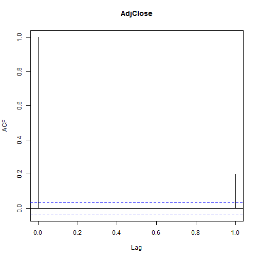
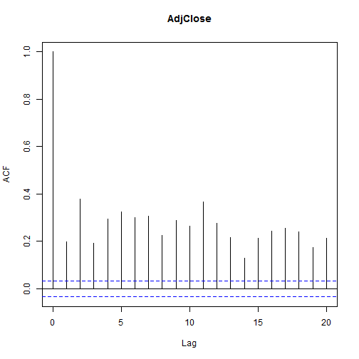

1 金融市场，价格和风险
========================================================
1.1 价格，回报率和股票指数
--------------------------------------
### 1.1.1 股票指数


1.2 S&P500 回报率
----------------------------------------

```r
library("tseries")  # load the tseries library
library("zoo")
```

```
## Attaching package: 'zoo'
```

```
## The following object is masked from 'package:base':
## 
## as.Date, as.Date.numeric
```

```r
price = get.hist.quote(instrument = "^gspc", start = "2000-01-01", quote = "AdjClose")  # download the prices,from January 1, 2000 until today
```

```
## time series starts 2000-01-03
```

```r
y = diff(log(price))  # convert the prices into returns
plot(y)  # plot the returns
```

 

```r
y = coredata(y)  # strip date information from returns
library(moments)
```

```
## Error: there is no package called 'moments'
```

```r
sd(y)
```

```
## [1] 0.0134
```

```r
min(y)
```

```
## [1] -0.0947
```

```r
max(y)
```

```
## [1] 0.1096
```

```r
skewness(y)
```

```
## Error: could not find function "skewness"
```

```r
kurtosis(y)
```

```
## Error: could not find function "kurtosis"
```

```r
acf(y, 1)
```

 

```r
acf(y^2, 1)
```

 

```r
jarque.bera.test(y)
```

```
## 
## 	Jarque Bera Test
## 
## data:  y
## X-squared = 7704, df = 2, p-value < 2.2e-16
```

```r
Box.test(y, lag = 20, type = c("Ljung-Box"))
```

```
## 
## 	Box-Ljung test
## 
## data:  y
## X-squared = 102.8, df = 20, p-value = 3.981e-13
```

```r
Box.test(y^2, lag = 20, type = c("Ljung-Box"))
```

```
## 
## 	Box-Ljung test
## 
## data:  y^2
## X-squared = 4615, df = 20, p-value < 2.2e-16
```

1.3 回报率的程式化因子
-------------------------
* 波动集群
* 后尾
* 非线性相关

1.4 波动率
-----------------------
收益率的标准偏差称为波动率

```r
library(MASS, stats)  # load stats and MASS package
q = acf(y, 20)
```

 

```r
plot(q[2:20])
```

 

```r
q = acf(y^2, 20)
```

 

```r
plot(q[2:20])
```

 

```r
b = Box.test(y, lag = 21, type = "Ljung-Box")
b
```

```
## 
## 	Box-Ljung test
## 
## data:  y
## X-squared = 111, df = 21, p-value = 3.164e-14
```


